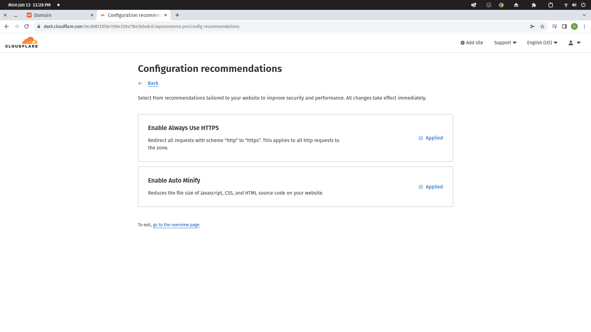
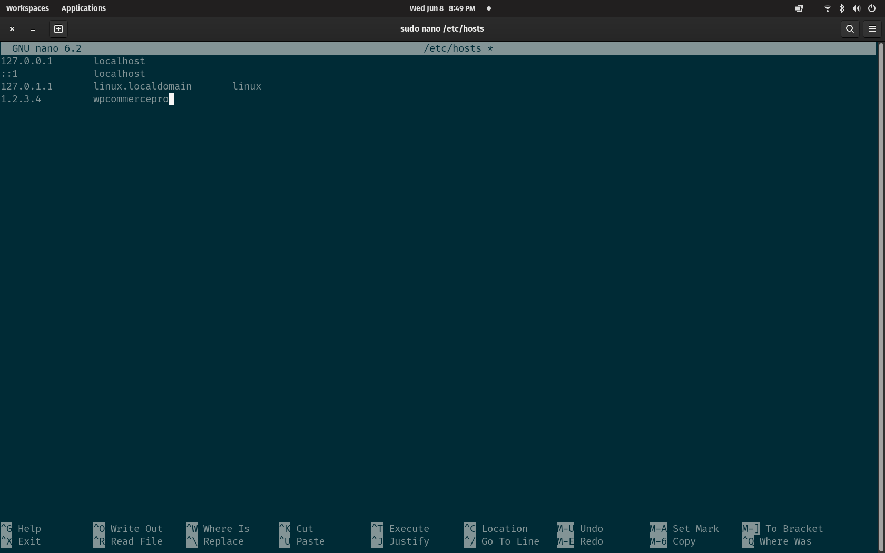
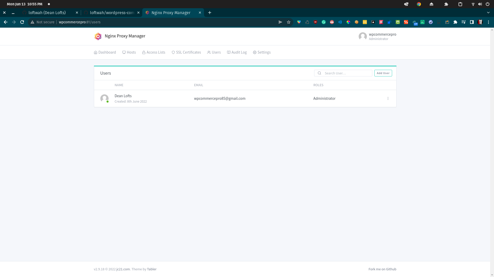

# WordPress Commerce Pro

WordPress Commerce Pro is a course that will teach you how to build a successful e-commerce store using WordPress. I will try to be vendor agnostic but in this example I will be using namecheap, Cloudflare and DigitalOcean. I will cover both options for those who are happy to dive into their terminal and for those who don't. I can't promise there will be completely free options for what we're doing but I will try to keep accessibility in mind as the content for this course grows.

I haven't decided on exactly what kind of content will be covered here, but it will be freely accesible until it isn't. I'm not going to pretend this isn't for some extra money on the side, but I do promise to give this my all and provide good quality content that you can actually learn from and that I do actually know what I am talking about, so please don't hesitate to contact me if you have any questions and when this isn't free there will be a full re-fund period with no questions asked.

For an example of something similar to what we are going to be doing, check out this [video](https://www.youtube.com/watch?v=q8vUTOXhCdw).

[](https://www.youtube.com/watch?v=q8vUTOXhCdw)

This is another somewhat related video that can give an idea of what we'll be covering.

[](https://www.youtube.com/watch?v=nU84fcRRcXc)

I blame [DorianDevelops](https://www.youtube.com/c/DorianDevelops) and [Jeff Geerling](https://www.youtube.com/channel/UCR-DXc1voovS8nhAvccRZhg) for keeping me so motived. They are great people worth watching on YouTube.

## Introduction

In this course you will learn how to put together a complete e-commerce store using WordPress. You will learn how to:

- Think of a name and register a domain name with namecheap
- Set up the infrastructure needed to host your store with DigitalOcean
- Set up a DNS server with Cloudflare to connect your domain name to your server
- Install and set up WordPress on your server
- Install the right plugins to enhance your store
- Install the right theme to enhance your store
- Set up your WooCommerce store
- Set up email with Google and AWS
- Set up payment with PayPal and Stripe
- Set up integration with Printful
- Optimise WordPress
- Learn about backups and security
- Learn about SEO (Search Engine Optimision) and how search works
- Maintain your store
- Set up users and roles to delegate effort to other people
- Maintain your infrastructure
- Monitor your store and how to fix problems
- What the fck is social media? (and how to use it)
- Automate social media posts
- Automate social media comments and interactions
- Create a chat bot to interact with your customers
- Automate maintenance tasks
- Scale WordPress
- Build a custom plugin
- Build a custom theme
- Git and GitHub
- Linux and the basics of system administration
- DevOps, GitOps and cloud native development with Docker and Kubernetes

## I am using GMail for my examples so I will create an account

These are the steps to create a Google account if you haven't seen it already or don't have one. We will be creating a new account for our business.


Fill out the required details and click the button to create your account.


## Think of a name and register a domain name with namecheap

[Cloudflare](https://dash.cloudflare.com/) | [GMail](https://mail.google.com/mail/u/0/#inbox) | [namecheap](https://www.namecheap.com/)

I will be using wpcommercepro85 as the name for a lot of my examples, so you can just replace it with whatever name you are using. If you don't have one and can't think of one you can generate something [here](https://codepen.io/rstacruz/full/wJyaJb/).

In your web browser, go to [namecheap.com](https://www.namecheap.com/) and sign up for a new account if you don't already have one.


The sign up process should look something like this:


Within namecheap you are able to search for domains that you can purchace. Search for the domain that you would like to use and follow the typical steps to purchase it.


I am searching for and buying the domain wpcommerce.pro.


Fill out the form and click the purchase button.


We will be configuring our namecheap domain name servers to use our own DNS (Domain Name System) servers, which will be provided by Cloudflare.

## Set up the infrastructure needed to host your store with DigitalOcean

If you don't already have an account, please sign up with [DigitalOcean](https://digitalocean.com)


You will need a method of payment for this one and the options are card or PayPal.


Click through the initial welcome screen and you'll find yourself at the DigitalOcean dashboard. You can change the settings of your project so the naming is more suitable for whatever project you are working on, in my example I will use wpcommercepro85.


## Set up DNS Cloudflare to connect your domain name to your server

Create an account with Cloudflare if you don't already have one.


When you're logged into Cloudflare, add a new site and choose the free plan. You will be able to add a domain name to your site and get the details required for configuring it within namecheap's DNS management console.


This part depends on you having your domain purchased and the DNS servers set up correctly, also you need the IP address of your server. Sign into Cloudflare, and add a site for your domain that you have purchased.


Add a record for your server, and leave the proxy switched off, for now. We will turn that on later. I set the following records.

| Type  | Name | Content        | Proxy Status | TTL  |
| ----- | ---- | -------------- | ------------ | ---- |
| CNAME | www  | wpcommerce.pro | off          | Auto |
| A     | \*   | your-server-ip | off          | Auto |
| A     | @    | your-server-ip | off          | Auto |

Once you have added the site, Cloudflare will prompt you to enable `auto HTTPS` and `auto minify`. I usually turn these on, but you can turn them off if you want.



From the dashboard of Cloudflare you can get your `Zone ID` and `Account ID`. You'll have to go into your profile settings if you want access to the `API` keys.

Now, you should be able to hit your domain if you have made it through the part where you set up and configured `Nginx Proxy Manager`. If you haven't, make sure to visit that section as it is a requirement from here on out.


`Congraulations! You have successfully set up your DNS with Cloudflare.` The next stage is [here](#) Nginx Proxy Manager TBA.

## Install and set up WordPress on your server

Now, because I have been busy and not able to come back to this for nearly a month, I have found the domain is suspended and I have to go through the support process to get it all back. This is actually kind of cool because it is a very real scenario that you will probably face sometime.


Sign into [DigitalOcean](https://cloud.digitalocean.com/) and create a new droplet. You can choose the size of the droplet and the region. In this example we'll use the smallest droplet you can use, but you should size yours accordingly, which we will cover later on in the guide.


If you have SSH keys, you can connect to your droplet with SSH. You can also connect to your droplet with the web interface, or by using a password. In this example I will be using SSH. If you don't have SSH keys and are interested, you can learn to generate them [here](https://lofts.sh/generate-ssh-gpg-keys/). If you don't want to nerd out and would like to use the web interface, `click here coming soon` to skip to that section.

You can choose from additional options such as backups, private networking, and more. Once you are ready click on the Create Droplet button and your droplet will be created.


Once your droplet is created you can access it from the dashboard, and if you added SSH keys you should be ready to connect to your new server.


Open the terminal on your system and enter `sudo nano /etc/hosts` and add your IP address along with a friendly name for your server. This way you can easily access your server from the command line without having to remember your IP address. Make sure to save and close whichever text editor you used for these changes. If you have already generated your SSH keys, you should be able to connect with `ssh wpcommercepro` using whatever name you have given your server. If you're anything like me and can't remember how to use SSH enter `curl cht.sh/ssh` for a quick refresher without having to leave your terminal or dig through `man pages`.



DigitalOcean provides some fantastic resources so if you're not familiat with the terminal at all and want to follow along with this part of the guide you should check this out as further reading.

[An Introduction to Linux Basics](https://www.digitalocean.com/community/tutorials/an-introduction-to-linux-basics) | [How to Set Up SSH Keys](https://www.digitalocean.com/community/tutorials/how-to-set-up-ssh-keys-on-ubuntu-20-04) | [Initial Server Setup](https://www.digitalocean.com/community/tutorials/initial-server-setup-with-ubuntu-20-04)

We will be borrwing quite heavily from the Initial Server Setup tutorial as it was an earlier version that I actually learnt to do a lot of this from.

So, assuming that you have your server in the `/etc/hosts` file, you can now add your SSH configuration file at `~/.ssh/config`. The contents of this file for me are as follows:

```bash
Host wpcommercepro
    HostName wpcommercepro
    User root
    Port 22
    IdentityFile ~/.ssh/id_rsa
```

You should be able to figure out which details to change to customize it for your environment. Now you are ready to connect to your server and set up your WordPress installation. Run the command `ssh wpcommercepro` replacing `wpcommercepro` with the name of your server. It should give you a bunch of information about system load and usage and also your IP address information, along with the prompt for the root account.

We don't want to be working directly as the root user, so we will be using the `wpcommercepro` user.

```bash
adduser wpcommercepro
```

Choose a password, fill out the info if you'd like and hit enter and you should be good to go.

To make sure our user is capable of doing the work we need to on the server, make sure the user is an administrator. Add your new user to the `sudo` group.

```bash
usermod -aG sudo wpcommercepro
```

To make sure you can access the server remotely on your new account, copy the `authorized_keys` file from the `root` user to your new account. The easiest way to do this is with the `rsync` tool.

```bash
rsync --archive --chown=wpcommercepro:wpcommercepro ~/.ssh /home/wpcommercepro
```

You can disconnect from the session you are logged into with `exit` and then reconnect with `ssh wpcommercepro`. You can now update you SSH config file to use the new user.

### Docker and Docker Compose

I like to use `Docker` on my systems so I can run any workload I need inside a container, rather than on the system itself. This is a great way to get around the limitations of the server.

```bash
curl -fsSL https://get.docker.com -o get-docker.sh
sh get-docker.sh
```

It will prompt you for your password, so it can have the permissions it needs to install the software. You should see a bunch of commands running and the entire process will look like this:

```bash
wpcommercepro@ubuntu-s-1vcpu-1gb-sgp1-01:~$ sh get-docker.sh
# Executing docker install script, commit: b2e29ef7a9a89840d2333637f7d1900a83e7153f
+ sudo -E sh -c apt-get update -qq >/dev/null
[sudo] password for wpcommercepro:
+ sudo -E sh -c DEBIAN_FRONTEND=noninteractive apt-get install -y -qq apt-transport-https ca-certificates curl >/dev/null
+ sudo -E sh -c mkdir -p /etc/apt/keyrings && chmod -R 0755 /etc/apt/keyrings
+ sudo -E sh -c curl -fsSL "https://download.docker.com/linux/ubuntu/gpg" | gpg --dearmor --yes -o /etc/apt/keyrings/docker.gpg
+ sudo -E sh -c chmod a+r /etc/apt/keyrings/docker.gpg
+ sudo -E sh -c echo "deb [arch=amd64 signed-by=/etc/apt/keyrings/docker.gpg] https://download.docker.com/linux/ubuntu focal stable" > /etc/apt/sources.list.d/docker.list
+ sudo -E sh -c apt-get update -qq >/dev/null
+ sudo -E sh -c DEBIAN_FRONTEND=noninteractive apt-get install -y -qq --no-install-recommends docker-ce docker-ce-cli containerd.io docker-compose-plugin docker-scan-plugin >/dev/null
+ version_gte 20.10
+ [ -z  ]
+ return 0
+ sudo -E sh -c DEBIAN_FRONTEND=noninteractive apt-get install -y -qq docker-ce-rootless-extras >/dev/null
+ sudo -E sh -c docker version
Client: Docker Engine - Community
 Version:           20.10.17
 API version:       1.41
 Go version:        go1.17.11
 Git commit:        100c701
 Built:             Mon Jun  6 23:02:57 2022
 OS/Arch:           linux/amd64
 Context:           default
 Experimental:      true

Server: Docker Engine - Community
 Engine:
  Version:          20.10.17
  API version:      1.41 (minimum version 1.12)
  Go version:       go1.17.11
  Git commit:       a89b842
  Built:            Mon Jun  6 23:01:03 2022
  OS/Arch:          linux/amd64
  Experimental:     false
 containerd:
  Version:          1.6.6
  GitCommit:        10c12954828e7c7c9b6e0ea9b0c02b01407d3ae1
 runc:
  Version:          1.1.2
  GitCommit:        v1.1.2-0-ga916309
 docker-init:
  Version:          0.19.0
  GitCommit:        de40ad0

================================================================================

To run Docker as a non-privileged user, consider setting up the
Docker daemon in rootless mode for your user:

    dockerd-rootless-setuptool.sh install

Visit https://docs.docker.com/go/rootless/ to learn about rootless mode.


To run the Docker daemon as a fully privileged service, but granting non-root
users access, refer to https://docs.docker.com/go/daemon-access/

WARNING: Access to the remote API on a privileged Docker daemon is equivalent
         to root access on the host. Refer to the 'Docker daemon attack surface'
         documentation for details: https://docs.docker.com/go/attack-surface/

================================================================================

wpcommercepro@ubuntu-s-1vcpu-1gb-sgp1-01:~$
```

We don't need to worry about rootless mode, but it is an option if you are concerned about security. You should use rootless mode when you are running `Docker` on a system that is not the same as the system you are running the `Docker` daemon on.

The next step is to get `Docker` running and in a usable state.

```bash
sudo service docker start
sudo systemctl enable docker
sudo usermod -a -G docker wpcommercepro
```

Exit and reconnect to the terminal session, and you should be able to test that `Docker` works by running:

```bash
docker run hello-world
```

The result should look somewhat like this:

```bash
wpcommercepro@ubuntu-s-1vcpu-1gb-sgp1-01:~$ docker run hello-world
Unable to find image 'hello-world:latest' locally
latest: Pulling from library/hello-world
2db29710123e: Pull complete
Digest: sha256:80f31da1ac7b312ba29d65080fddf797dd76acfb870e677f390d5acba9741b17
Status: Downloaded newer image for hello-world:latest

Hello from Docker!
This message shows that your installation appears to be working correctly.

To generate this message, Docker took the following steps:
 1. The Docker client contacted the Docker daemon.
 2. The Docker daemon pulled the "hello-world" image from the Docker Hub.
    (amd64)
 3. The Docker daemon created a new container from that image which runs the
    executable that produces the output you are currently reading.
 4. The Docker daemon streamed that output to the Docker client, which sent it
    to your terminal.

To try something more ambitious, you can run an Ubuntu container with:
 $ docker run -it ubuntu bash

Share images, automate workflows, and more with a free Docker ID:
 https://hub.docker.com/

For more examples and ideas, visit:
 https://docs.docker.com/get-started/

wpcommercepro@ubuntu-s-1vcpu-1gb-sgp1-01:~$
```

If your terminal looks the same as this, you have successfully installed and are now able to use `Docker`.

Next up we will install `Docker-Compose`.

```bash
sudo curl -L https://github.com/docker/compose/releases/latest/download/docker-compose-$(uname -s)-$(uname -m) -o /usr/local/bin/docker-compose
sudo chmod +x /usr/local/bin/docker-compose
docker-compose version
```

You should see the following:

```bash
wpcommercepro@ubuntu-s-1vcpu-1gb-sgp1-01:~$ docker-compose --version
Docker Compose version v2.6.0
```

More advanced users might want to script this process so it can be automated in the future. Here are what those scripts could look like if you wanted to go down that path.

- Shell Script to Install Docker on Ubuntu

```bash
#!/bin/bash
set -e
#Uninstall old versions
sudo apt-get remove docker docker-engine docker.io containerd runc
#Update the apt package index:
sudo apt-get update
#Install packages to allow apt to use a repository over HTTPS:
sudo apt-get install -y \\
    apt-transport-https \\
    ca-certificates \\
    curl \\
    gnupg-agent \\
    software-properties-common
# Add docker's package signing key
curl -fsSL https://download.docker.com/linux/ubuntu/gpg | sudo apt-key add -
# Add repository
sudo add-apt-repository -y \\
  "deb \[arch=amd64\] https://download.docker.com/linux/ubuntu \\
  $(lsb\_release -cs) \\
  stable"
# Install latest stable docker stable version
sudo apt-get update
sudo apt-get -y install docker-ce
# Enable & start docker
sudo systemctl enable docker
sudo systemctl start docker
# add current user to the docker group to avoid using sudo when running docker
sudo usermod -aG docker $USER
 # Output current version
docker -v
```

- Shell Script to Install the latest version of Docker Compose

```bash
#!/bin/bash
# get latest docker compose released tag
COMPOSE\_VERSION=$(curl -s https://api.github.com/repos/docker/compose/releases/latest | grep 'tag\_name' | cut -d\\" -f4)
sudo curl -L "https://github.com/docker/compose/releases/download/${COMPOSE\_VERSION}/docker-compose-$(uname -s)-$(uname -m)" -o /usr/local/bin/docker-compose
sudo chmod a+x /usr/local/bin/docker-compose
sudo ln -s /usr/local/bin/docker-compose /usr/bin/docker-compose
# Output the  version
docker-compose -v
```

### Nginx Proxy Manager

I really like a tool called `Nginx Proxy Manager` that makes using and managing `Nginx` easy. To set it up create a directory called `nginx`, enter it with `cd nginx` and create a file called `docker-compose.yml` with the following contents:

```yaml
version: "3"
services:
  app:
    image: "jc21/nginx-proxy-manager:latest"
    restart: unless-stopped
    ports:
      # These ports are in format <host-port>:<container-port>
      - "80:80" # Public HTTP Port
      - "443:443" # Public HTTPS Port
      - "81:81" # Admin Web Port
      # Add any other Stream port you want to expose
      # - '21:21' # FTP

    # Uncomment the next line if you uncomment anything in the section
    # environment:
    # Uncomment this if you want to change the location of
    # the SQLite DB file within the container
    # DB_SQLITE_FILE: "/data/database.sqlite"

    # Uncomment this if IPv6 is not enabled on your host
    # DISABLE_IPV6: 'true'

    volumes:
      - ./data:/data
      - ./letsencrypt:/etc/letsencrypt
```

Save the file and run the `docker-compose up -d` command. It will pul the required files from the internet and should look something like this.


One `Nginx Proxy Manager` is up and running you should be able to access it via [this](http://127.0.0.1:81/) URL.

The default credentials are Email address: `admin@example.com` and Password: `changeme`.


Once you have logged in you'll be asked to change your credentials, which you can choose yourself.

Change your password, you'll need to type the initial `changeme` password and then your own twice. You should see something that looks like this.



### namecheap domain issue

My domain was temporarily suspended and it looks like it was because I never received an email where I needed to verify my details. I was able to have the email re-sent and it worked this time around, and the domain should be unsuspended.


#### Nginx Proxy Manager Configuration

Sign into `Nginx Proxy Manager` and click on the `SSL Certificates` tab. Add an SSL certificate for your domain, and also an SSL certificate for a wildcare of all of your subdomains if you want the convenience. You will need your `API` key from Cloudflare to set this up. Sign into Cloudflare at this [URL](https://dash.cloudflare.com/profile/api-tokens) to get access to your `API` key.


### WordPress installation and configuration

Connect to your server using `ssh` and create the file `~/wordpress/docker-compose.yml` with the following contents: Make sure you update toe variables with your own information.

```yaml
services:
  db:
    # We use a mariadb image which supports both amd64 & arm64 architecture
    image: mariadb:10.6.4-focal
    # If you really want to use MySQL, uncomment the following line
    #image: mysql:8.0.27
    command: "--default-authentication-plugin=mysql_native_password"
    volumes:
      - db_data:/var/lib/mysql
    restart: always
    environment:
      - MYSQL_ROOT_PASSWORD=somewordpress
      - MYSQL_DATABASE=wordpress
      - MYSQL_USER=wordpress
      - MYSQL_PASSWORD=wordpress
    expose:
      - 3306
      - 33060
  wordpress:
    image: wordpress:latest
    ports:
      - 8081:80
    restart: always
    environment:
      - WORDPRESS_DB_HOST=db
      - WORDPRESS_DB_USER=wordpress
      - WORDPRESS_DB_PASSWORD=wordpress
      - WORDPRESS_DB_NAME=wordpress
volumes:
  db_data:
```

Save the file and run `docker-compose up -d`. We changed the `port` to `8081` so that we can access the WordPress site at `http://<your-server-ip>:8081/`

## Install the right plugins to enhance your store

## Install the right theme to enhance your store

## Set up your WooCommerce store

## Set up email with Google and AWS (Amazon Web Services)

## Set up payment with PayPal and Stripe

## Set up integration with Printful and sell custom print on demand merchandise

## Optimise WordPress

## Learn about backups and security

## Learn about SEO (Search Engine Optimision) and how search works

## Maintain your store

## Set up users and roles to delegate effort to other people

## Maintain your infrastructure

## Monitor your store and how to fix problems

## What the fck is social media? (and how to use it)

## Automate social media posts

## Automate social media comments and interactions

## Create a chat bot to interact with your customers

## Automate maintenance tasks

## Scale WordPress

## Build a custom plugin

## Build a custom theme

## Git and GitHub

Git is a version control system for tracking changes in computer files and coordinating work on those files among multiple people. Git is designed for teams to work together on a project, with many people working on the project at the same time. GitHub is a web-based hosting service for version control using Git.

Configure Git

```bash
git config --global user.name "Dean Lofts"
git config --global user.email "dean@deanlofts.xyz"
```

To sign your work with GPG, you can follow the following steps:

```bash
# Generate a new pgp key: (better to use gpg2 instead of gpg in all below commands)
gpg --gen-key
# maybe you need some random work in your OS to generate a key. so run this command: `find ./* /home/username -type d | xargs grep some_random_string > /dev/null`
# check current keys:
gpg --list-secret-keys --keyid-format LONG
# See your gpg public key:
gpg --armor --export YOUR_KEY_ID
# YOUR_KEY_ID is the hash in front of `sec` in previous command. (for example sec 4096R/234FAA343232333 => key id is: 234FAA343232333)
# Set a gpg key for git:
git config --global user.signingkey your_key_id
# To sign a single commit:
git commit -S -a -m "Test a signed commit"
# Auto-sign all commits globaly
git config --global commit.gpgsign true
```

`GPG` should be installed by default if you are using `Ubuntu` as your Operating System, but if it isn't you'll need to install it.

## Linux and the basics of system administration

## DevOps, GitOps and cloud native development with Docker and Kubernetes

## License

I have chosen [GPLv3](https://www.gnu.org/licenses/gpl-3.0.en.html) as my license because it is the same as [WordPress](https://wordpress.org) itself.

## References, Resources and Further Reading

- [What is DNS? How DNS works](https://www.cloudflare.com/en-au/learning/dns/what-is-dns/)

## Sponsor

I am not selling this course in its infancy, so if you find this useful in any way please [support](https://paypal.me/loftwah) if you are able to, it is much appreciated.
